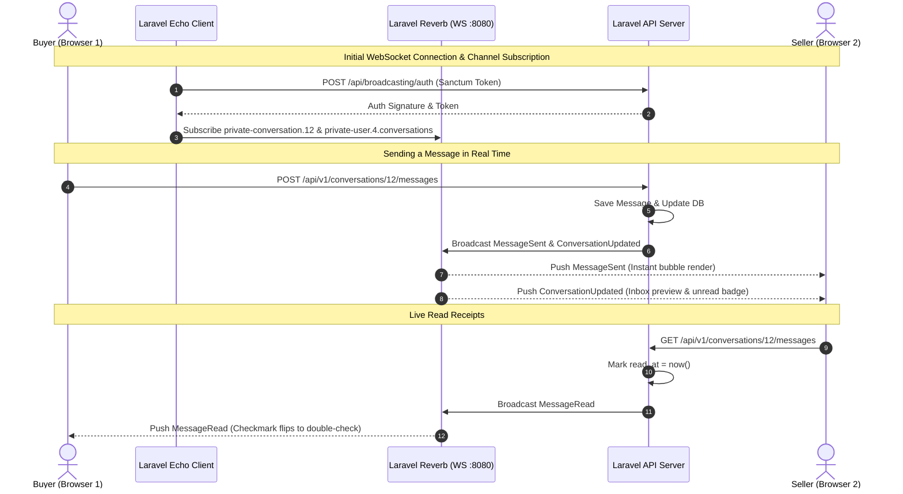

# Loved-IT Messaging & Chat System — Technical Documentation

This document details the architecture, database schema, backend API endpoints, frontend state management, user flows, and real-time polling mechanisms for the **Loved-IT Unified Messaging System**.

---

## 1. System Overview & Roles

Loved-IT implements a role-based, context-aware messaging system designed for general marketplace operations:

```mermaid
flowchart TD
    Buyer([Buyer]) <-->|Product Questions & Order Inquiries| Seller([Seller])
    Buyer <-->|Platform Support & Disputes| Admin([Admin])
    Seller <-->|Store Verification & Payout Queries| Admin

    subgraph Prohibited Interactions
        B1([Buyer]) -.x.- B2([Buyer])
        S1([Seller]) -.x.- S2([Seller])
    end
```

### Role Matrix & Permissions
| Interaction | Allowed | Description |
| :--- | :---: | :--- |
| **Buyer ↔ Seller** | ✅ | Product inquiries, stock/shipping questions, order updates |
| **Buyer ↔ Admin** | ✅ | Customer support tickets, order dispute inquiries |
| **Seller ↔ Admin** | ✅ | Partner support, payout issues, application/compliance appeals |
| **Buyer ↔ Buyer** | ❌ | Disabled by security rules |
| **Seller ↔ Seller** | ❌ | Disabled by security rules |
| **Any Role ↔ Rider** | ❌ | Reserved for future logistics module |

---

## 2. Database Schema

The database uses two primary tables: `conversations` and `messages`.

### `conversations` Table
| Column | Type | Nullable | Description |
| :--- | :--- | :---: | :--- |
| `id` | `BIGINT UNSIGNED` | ❌ | Primary Key |
| `buyer_id` | `BIGINT UNSIGNED` | ✅ | Foreign key referencing `users(id)` (Buyer participant) |
| `seller_id` | `BIGINT UNSIGNED` | ✅ | Foreign key referencing `users(id)` (Seller participant) |
| `type` | `ENUM` | ❌ | `'buyer_seller'`, `'buyer_admin'`, `'seller_admin'` |
| `status` | `ENUM` | ❌ | `'open'`, `'resolved'` (default: `'open'`) |
| `subject` | `VARCHAR(255)` | ✅ | Topic / issue title (used for support tickets) |
| `product_id` | `BIGINT UNSIGNED` | ✅ | Foreign key referencing `products(id)` for pinned product card |
| `order_id` | `BIGINT UNSIGNED` | ✅ | Foreign key referencing `orders(id)` for pinned order card |
| `buyer_unread` | `INT UNSIGNED` | ❌ | Unread messages count for the Buyer (default: `0`) |
| `seller_unread` | `INT UNSIGNED` | ❌ | Unread messages count for the Seller (default: `0`) |
| `admin_unread` | `INT UNSIGNED` | ❌ | Unread messages count for Admin (default: `0`) |
| `last_message_at` | `TIMESTAMP` | ✅ | Timestamp of the latest message for ordering |
| `created_at` / `updated_at` | `TIMESTAMP` | ❌ | Timestamps |

### `messages` Table
| Column | Type | Nullable | Description |
| :--- | :--- | :---: | :--- |
| `id` | `BIGINT UNSIGNED` | ❌ | Primary Key |
| `conversation_id` | `BIGINT UNSIGNED` | ❌ | Foreign key referencing `conversations(id)` (Cascade delete) |
| `sender_id` | `BIGINT UNSIGNED` | ❌ | Foreign key referencing `users(id)` |
| `body` | `TEXT` | ❌ | Text message content |
| `attachment_type` | `VARCHAR(50)` | ✅ | Type of attachment (`product_card`, `order_card`, `image`) |
| `attachment_data` | `JSON` | ✅ | Structured payload (e.g. `{ id, name, price, image }`) |
| `read_at` | `TIMESTAMP` | ✅ | Timestamp when recipient viewed the message |
| `created_at` / `updated_at` | `TIMESTAMP` | ❌ | Timestamps |

---

## 3. Backend API Endpoints

All endpoints are authenticated via Laravel Sanctum (`auth:sanctum`) under `/api/v1/conversations`.

### 1. `GET /api/v1/conversations`
Retrieves a list of conversations for the authenticated user, automatically scoped by their role.

- **Query Parameters**:
  - `type` (`buyer_seller` \| `buyer_admin` \| `seller_admin`)
  - `status` (`open` \| `resolved`)
  - `unread_only` (`true` \| `false`)
  - `search` (Search by shop name, user name, subject, or message body)
- **Response**:
```json
{
  "data": [
    {
      "id": 12,
      "type": "buyer_seller",
      "status": "open",
      "buyer_id": 4,
      "seller_id": 2,
      "recipient": {
        "id": 2,
        "name": "Tech Haven Official",
        "role": "seller",
        "avatar": "/storage/shops/logo.png",
        "subtext": "Merchant"
      },
      "product": {
        "id": 8,
        "name": "Mechanical Keyboard RGB",
        "price": 2499.00,
        "image": "/storage/products/kb.jpg"
      },
      "last_message": {
        "id": 45,
        "body": "Yes, blue switches are available!",
        "sender_id": 2,
        "created_at": "2026-09-02T04:20:00Z"
      },
      "unread": 1,
      "last_message_at": "2026-09-02T04:20:00Z"
    }
  ]
}
```

---

### 2. `GET /api/v1/conversations/unread-count`
Returns the total unread messages count for the current user. Used for the floating badge indicator.

- **Response**:
```json
{
  "data": {
    "unread_count": 3
  }
}
```

---

### 3. `POST /api/v1/conversations/start`
Finds an existing conversation or creates a new one with optional product/order context and an initial message.

- **Request Body**:
```json
{
  "type": "buyer_seller",
  "seller_id": 2,
  "product_id": 8,
  "initial_message": "Hello, is this item available in stock?"
}
```

---

### 4. `GET /api/v1/conversations/{id}/messages`
Fetches the message stream for a specific conversation. Automatically marks incoming unread messages as read for the viewing user and resets the user's unread counter.

- **Query Parameters**:
  - `since` (`ISO-8601 string`, e.g. `2026-09-02T04:00:00Z` for incremental delta polling)
- **Response**:
```json
{
  "data": [
    {
      "id": 44,
      "conversation_id": 12,
      "sender_id": 4,
      "sender_name": "Juan Dela Cruz",
      "sender_role": "buyer",
      "body": "Hello, is this item available in stock?",
      "attachment_type": "product_card",
      "attachment_data": {
        "id": 8,
        "name": "Mechanical Keyboard RGB",
        "price": 2499.00,
        "image": "/storage/products/kb.jpg"
      },
      "read_at": "2026-09-02T04:15:00Z",
      "created_at": "2026-09-02T04:10:00Z"
    },
    {
      "id": 45,
      "conversation_id": 12,
      "sender_id": 2,
      "sender_name": "Tech Haven Official",
      "sender_role": "seller",
      "body": "Yes, blue switches are available!",
      "attachment_type": null,
      "attachment_data": null,
      "read_at": null,
      "created_at": "2026-09-02T04:20:00Z"
    }
  ]
}
```

---

### 5. `POST /api/v1/conversations/{id}/messages`
Sends a message into the conversation thread. Increments the unread counter for the counterparty.

- **Request Body**:
```json
{
  "body": "Can I pick this up tomorrow?",
  "attachment_type": null,
  "attachment_data": null
}
```

---

### 6. `PATCH /api/v1/conversations/{id}/status`
Updates the ticket resolution state (used primarily by Admin and Sellers).

- **Request Body**:
```json
{
  "status": "resolved"
}
```

---

## 4. Frontend Architecture & User Experiences

Loved-IT separates the buyer, seller, and admin interfaces to match their functional needs:

```
┌─────────────────────────────────────────────────────────────┐
│                      Loved-IT Chat UI                       │
├──────────────────────────┬──────────────────────────────────┤
│ Buyer Experience         │ Floating Messenger Widget        │
│                          │ + Dedicated Settings Messages    │
├──────────────────────────┼──────────────────────────────────┤
│ Seller Experience        │ 2-Pane Seller Center Inbox       │
├──────────────────────────┼──────────────────────────────────┤
│ Admin Experience         │ Multi-Role Support Dashboard     │
└──────────────────────────┴──────────────────────────────────┘
```

### A. Buyer Interface (Floating Messenger & Full-screen Page)
1. **Floating Launcher (`BuyerFloatingChat.tsx`)**:
   - Pinned at the bottom-right corner of all public and buyer-facing pages (`#A32D2D` Loved-IT Red).
   - Animated unread counter badge (`1`, `2`, `99+`).
   - Click opens a sleek floating window (`390px × 580px`).
2. **Conversation List View**:
   - Search bar for stores and message text.
   - Tabs: `All`, `Sellers`, `Support`.
   - Contact Support quick button.
3. **Active Chat Window**:
   - Pinned **Product Context Card** with thumbnail, item title, price in ₱, and "View Product" button.
   - Pinned **Order Context Card** with Order #, status badge, and "View Order" button.
   - Real-time message bubbles with timestamps and double-check read receipts (`✓✓`).
   - Quick inquiry action chips (*"📦 Is this in stock?"*, *"🚚 When will it ship?"*, *"📸 Actual photos?"*).
4. **Full-screen Page (`BuyerMessagesPage.tsx`)**:
   - Available under `My Account → Messages & Inquiries` (`/settings/messages`).

---

### B. Seller Interface (Seller Center Inbox)
1. **Location**: `/seller/messages` (nav item in Seller sidebar).
2. **Layout**: Professional 2-pane dashboard:
   - **Left Pane**: Search bar, custom filter dropdown (*All Conversations*, *Buyer Inquiries*, *Admin Support*, *Unread Messages*).
   - **Right Pane**: Customer header card with buyer name and email.
   - **Context Banners**: Pinned product card with direct link to product management, and pinned customer order card with status and link to order fulfillment.
   - **Quick Seller Templates**: One-click replies (*"✅ In Stock"*, *"📦 Order Packed"*, *"🙏 Thank You"*).

---

### C. Admin Interface (Support & Inquiries Dashboard)
1. **Location**: `/admin/messages` (accessible from Admin sidebar and TopBar).
2. **Layout**: Professional support ticketing layout:
   - **Filter Controls**: Multi-role filter (*All Inquiries*, *Buyer Support*, *Seller Support*, *Marketplace Chats*) and status filter (*All*, *Open*, *Resolved*).
   - **Ticket Controls**: One-click **"Mark as Resolved" / "Reopen"** button.
   - **Context Inspection**: Direct link to Admin Product Review and Admin Order Review.
   - **Official Admin Response Templates**: Quick support macros (*"⏳ Reviewing Inquiry"*, *"✅ Processed"*, *"🙏 Sign-off"*).

---

## 5. Real-Time WebSockets Architecture (Laravel Reverb & Echo)

The messaging system uses WebSocket communication via **Laravel Reverb** and **Laravel Echo**, eliminating polling latency:

### WebSocket Channels & Events:
1. **`conversation.{conversationId}` (Private Channel)**:
   - `MessageSent`: Broadcasts newly created chat message directly to chat participants.
   - `MessageRead`: Broadcasts read timestamp so sender's single-check instantly turns to a double-check.
   - Channel Authorization: Restricted to the conversation buyer, the merchant seller, or an admin.
2. **`user.{userId}.conversations` (Private Channel)**:
   - `ConversationUpdated`: Broadcasts to recipient's personal channel whenever a new message arrives, a conversation is created, or a status changes, updating inbox previews, sorting, and unread counts in real-time.



---

## 6. How Entry Points are Wired

| Location | Component | Action |
| :--- | :--- | :--- |
| **Product Detail Page** | [ProductDetailPage.tsx](file:///c:/Projects/basta_velure/frontend/src/pages/ProductDetailPage.tsx) | "Chat" button calls `openChatWithSeller(seller.id, productContext)` |
| **Shop Profile Page** | [ShopProfilePage.tsx](file:///c:/Projects/basta_velure/frontend/src/pages/ShopProfilePage.tsx) | "Chat" button calls `openChatWithSeller(profile.seller_id)` |
| **Buyer Settings** | [SettingsPage.tsx](file:///c:/Projects/basta_velure/frontend/src/pages/SettingsPage.tsx) | Sidebar item links to `/settings/messages` |
| **Seller Center** | [SellerLayout.tsx](file:///c:/Projects/basta_velure/frontend/src/pages/seller/SellerLayout.tsx) | Sidebar item links to `/seller/messages` with unread badge |
| **Admin Panel** | [AdminLayout.tsx](file:///c:/Projects/basta_velure/frontend/src/pages/admin/AdminLayout.tsx) | Sidebar item and TopBar icon link to `/admin/messages` |
| **Global Buyer Overlay** | [App.tsx](file:///c:/Projects/basta_velure/frontend/src/App.tsx) | `<BuyerFloatingChat />` mounted globally inside `<ChatProvider>` |
