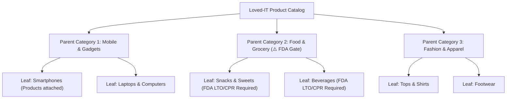

# Loved-IT — Marketplace Category System Architecture & Admin Specification

## 1. Executive Overview

Loved-IT operates on a **strictly governed two-level (Parent → Leaf) category hierarchy**. 
This architecture ensures lightning-fast catalog querying, clear mobile storefront navigation, and strict compliance enforcement for regulated product sectors (such as Food & Grocery).



---

## 2. Category Hierarchy Rules

### Layer 1: Parent Category (Root Grouping)
- **Purpose**: Broad umbrella categorization used for top navigation bars, header mega-menus, and seller listing entry points (`/category/:parentId`).
- **Product Attachment**: **Strictly Disallowed**. Products cannot be attached directly to a parent category.
- **Attributes**: `id`, `slug`, `name`, `parent_id = NULL`, `sort_order`, `is_active`.

### Layer 2: Leaf Sub-Category (Target Entity)
- **Purpose**: Precise item classification where all merchant listings reside (`products.category_id` references leaf `id`).
- **Product Attachment**: **Required**. All listings belong to a specific leaf sub-category.
- **Special Compliance & Financial Flags**:
  - `requires_fda`: Flags categories that require mandatory FDA verification (LTO & CPR/CPN documents).
  - `commission_rate`: Optional category-specific commission override (e.g., 8.0% instead of platform base 10.0%).
  - `is_active`: Toggles visibility in seller add-product dropdowns and buyer navigation.

---

## 3. Database Schema & Models

### SQL Schema (`categories` & `products`)
```sql
CREATE TABLE `categories` (
  `id` BIGINT UNSIGNED AUTO_INCREMENT PRIMARY KEY,
  `slug` VARCHAR(100) NOT NULL UNIQUE,
  `name` VARCHAR(100) NOT NULL,
  `parent_id` BIGINT UNSIGNED NULL,
  `sort_order` SMALLINT UNSIGNED NOT NULL DEFAULT 0,
  `is_active` BOOLEAN NOT NULL DEFAULT TRUE,
  `requires_fda` BOOLEAN NOT NULL DEFAULT FALSE,
  `commission_rate` DECIMAL(5, 2) NULL, -- Optional override % (e.g. 8.00)
  `created_at` TIMESTAMP NULL,
  `updated_at` TIMESTAMP NULL,
  CONSTRAINT `fk_categories_parent` 
    FOREIGN KEY (`parent_id`) REFERENCES `categories` (`id`) 
    ON DELETE RESTRICT ON UPDATE CASCADE
);

CREATE TABLE `products` (
  `id` BIGINT UNSIGNED AUTO_INCREMENT PRIMARY KEY,
  `category_id` BIGINT UNSIGNED NOT NULL,
  -- other product fields...
  CONSTRAINT `fk_products_category` 
    FOREIGN KEY (`category_id`) REFERENCES `categories` (`id`) 
    ON DELETE RESTRICT
);
```

### Eloquent Relationships (`Category.php`)
```php
namespace App\Models;

use Illuminate\Database\Eloquent\Model;
use Illuminate\Database\Eloquent\Relations\BelongsTo;
use Illuminate\Database\Eloquent\Relations\HasMany;

class Category extends Model
{
    protected $fillable = [
        'slug', 'name', 'parent_id', 'sort_order',
        'is_active', 'requires_fda', 'commission_rate',
    ];

    protected $casts = [
        'is_active'       => 'boolean',
        'requires_fda'    => 'boolean',
        'commission_rate' => 'float',
    ];

    /** Parent category (null if top-level) */
    public function parent(): BelongsTo
    {
        return $this->belongsTo(Category::class, 'parent_id');
    }

    /** Children leaf sub-categories */
    public function children(): HasMany
    {
        return $this->hasMany(Category::class, 'parent_id')->orderBy('sort_order');
    }

    /** Products attached directly to this leaf */
    public function products(): HasMany
    {
        return $this->hasMany(Product::class, 'category_id');
    }
}
```

---

## 4. Policy, Compliance & Financial Integrations

| Feature | Behavior in Category System |
|---|---|
| **FDA Verification Gate** | If a leaf category has `requires_fda: true`, the listing workflow (`SellerAddProductPage`) forces the merchant to provide valid FDA License to Operate (LTO) and Certificate of Product Registration (CPR) before review submission. |
| **Take-Rate Engine** | When a buyer checks out, the commission calculation inspects the product's leaf category. If a category override is active (e.g., 8%), that rate takes precedence over the platform standard 10% base rate. |
| **Return & Refund SLA** | Perishable categories under Food & Grocery cannot be returned once opened/unsealed for consumer health and hygiene safety. Damaged or expired items receive direct refund mediation. |

---

## 5. Complete Category Taxonomy

| # | Parent Category (Slug) | Leaf Sub-Categories | Compliance / Overrides |
|---|---|---|---|
| 1 | **Mobile, Gadgets & Computers** (`mobile-gadgets-computers`) | Smartphones, Laptops, Earphones & Audio, Powerbanks & Cables, Phone Accessories | Standard 10% |
| 2 | **Food & Grocery** (`food-grocery`) | Snacks & Sweets, Beverages, Fresh Produce, Instant Meals, Pantry Staples | ⚠️ `requires_fda: true`, 8% Override |
| 3 | **Home Appliances** (`home-appliances`) | Refrigerators, Electric Fans, Air Conditioners, Washing Machines, Kitchen Appliances | Standard 10% |
| 4 | **Home & Living** (`home-living`) | Furniture, Home Decor, Bedding & Linens, Cookware, Storage & Organizers | Standard 10% |
| 5 | **Home Improvement & Tools** (`home-improvement-tools`) | Hand Tools, Power Tools, Hardware, Lighting Fixtures, Plumbing Supplies | Standard 10% |
| 6 | **Women's Fashion** (`womens-fashion`) | Tops, Dresses, Bottoms, Outerwear & Jackets, Footwear | Standard 10% |
| 7 | **Men's Fashion** (`mens-fashion`) | Shirts & Polos, Pants & Jeans, Jackets & Outerwear, Footwear | Standard 10% |
| 8 | **Bags & Accessories** (`bags-accessories`) | Bags & Wallets, Jewelry, Watches, Sunglasses & Eyewear | Standard 10% |
| 9 | **Health & Beauty** (`health-beauty`) | Skincare, Makeup & Cosmetics, Personal Care, Hair Care | Standard 10% |
| 10 | **Sports & Outdoors** (`sports-outdoors`) | Fitness Equipment, Camping Gear, Sportswear, Bicycles & Parts | Standard 10% |
| 11 | **Automotive & Motorcycle** (`automotive-motorcycle`) | Car Accessories, Motorcycle Parts, Riding Helmets, Car Care & Oils | Standard 10% |
| 12 | **Baby & Kids** (`baby-kids`) | Baby Gear & Strollers, Kids Clothing, Feeding & Nursing, Diapers | Standard 10% |
| 13 | **Toys, Hobbies & Books** (`toys-hobbies-books`) | Toys & Action Figures, Collectibles, Novels & Books, Art Supplies | Standard 10% |
| 14 | **Pet Supplies** (`pet-supplies`) | Pet Food & Treats, Pet Accessories, Pet Health & Grooming | Standard 10% |

---

## 6. Admin Categories Management Architecture (`AdminCategoriesPage.tsx`)

To give platform administrators full command over the marketplace taxonomy, the upcoming **Admin Categories Page** includes:

### 1. Executive Header & Analytics
- Dark command header matching the modern Admin Dashboard layout (`bg-neutral-900 border border-neutral-800`).
- 4 Compact Category Metric Cards:
  - **Total Parent Categories** (e.g. 14 Active)
  - **Total Leaf Sub-Categories** (e.g. 68 Nodes)
  - **Catalog Items Covered** (Total active products mapped)
  - **FDA Regulated Categories** (e.g. 5 Nodes with Food & Grocery safeguard)

### 2. Hierarchical Category Tree & Grid
- **Accordion Parent Cards**: Collapsible cards displaying the parent category, icon, slug, status, and attached leaf count.
- **Leaf Subcategory Chips/Rows**:
  - Live active/inactive toggle switch.
  - FDA Compliance badge indicator (`requires_fda`).
  - Active commission take-rate override badge (`8.0%` vs `Default 10%`).
  - Product count counter (`N items listed`).

### 3. Category Management Modal (Create / Edit)
- Fields:
  - Category Level: `Parent Category` or `Sub-Category (Child)`
  - Parent Selector (if Sub-Category): Powered by `CustomSelect`
  - Name (e.g. "Smartphones") & Auto-generated or custom Slug (e.g. "smartphones")
  - Sort Order index
  - FDA Compliance Requirement toggle
  - Custom Commission Override Rate (% input)
  - Active/Inactive status toggle

### 4. Admin API Endpoints
```http
GET    /api/v1/admin/categories            # Returns full tree with product and active listing counts
POST   /api/v1/admin/categories            # Create new parent or leaf category
PUT    /api/v1/admin/categories/{id}       # Update category attributes, FDA flag, or override rate
DELETE /api/v1/admin/categories/{id}       # Safe delete (blocked if products or leaves are attached)
```
